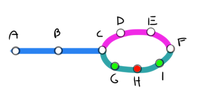

# Red de metro

[TOC]

Para este proyecto se solicitó por parte del equipo de Buda que se desarrolle un programa al cual se le entregue una red de metro, con estaciones de diferentes colores y ramificaciones, como se muestra en la imagen a continuación:



Esta red es entregada al programa en el archivo `red.JSON`, que contiene tres tipos de objetos:

* **Estaciones**: Objetos en los que se podría detener el tren, que cuentan con un color, un tipo (estación, en este caso) y un nombre.
* **Divisiones**: Puntos que marcan una división (como la línea morada y la verde en la imagen de ejemplo).
* **Ramificaciones**: Ramas que contienen  estaciones y que serán comparadas para determinar la ruta más corta.

La red se puede generar desde el archivo `generate_json.py `, siguiendo los criterios explicitados más adelante.

El tren que recorrerá la red es también un objeto, un diccionario de Python, y es el que almacenará la información de las posibles rutas para después devolver la ruta más corta.

## Funcionamiento del programa

El programa debe recibir un archivo con nombre `red.JSON`, este archivo se leerá por el programa y almacenará su contenido en una variable con nombre **red**, la red se puede declarar directamente en formato JSON o se puede utilizar el programa `generate_json.py`, en el que se declarará el objeto como una lista, en la que cada ítem será una **estación**, una **división** o una **ramificación**, cada tipo de objeto se diferenciará por su atributo **type** y cumplirá una función específica para el funcionamiento del código, así que es de vital importancia tener cuidado al introducir estos valores.

### Generar una red utilizando `generate_json.py`

El programa cuenta con una red por defecto, esta es la misma que la misma que la de la imagen, es decir:

```python
red = [
    {"type":"estacion","estacion": "A", "color": "none"},
    {"type":"estacion","estacion": "B", "color": "none"},
    {"type":"estacion","estacion": "C", "color": "none"},
    {"type":"div","name":"ram_1","ramif": [{
      "type":"ram", "name":"ram_1_1","ram":[
        {"type":"estacion","estacion": "D", "color": "none"},
        {"type":"estacion","estacion": "E", "color": "none"}
      ]
    },
    {
    "type":"ram", "name":"ram_1_2","ram":[
      {"type":"estacion","estacion": "G", "color": "verde"},
      {"type":"estacion","estacion": "H", "color": "rojo"},
      {"type":"estacion","estacion": "I", "color": "verde"}
    ]
    }]
    },
    {"type":"estacion","estacion":"F", "color":"none"}

]

```

Es aquí donde se debe reemplazar el valor de esta variable con la información que se quiera aportar a la red

#### Para generar una estación
``` python
{'type': 'estacion', 'estacion':<NOMBRE>, 'color': <COLOR>}
```
El nombre de la estación admite cualquier valor como string y el color debe ser un string que después se comparará con el color del tren. Las estaciones sirven para que el programa pueda calcular en cuantas estaciones debe detenerse y cuál es la ruta más corta en caso de encontrar una división en la red.


#### Para generar una división en la ruta

``` python
{"type":"div","name":<NAME>,"ramif": [
    {"type":"ram", "name":<NAME>,"ram":[ESTACIÓN]},
    {"type":"ram", "name":<NAME>,"ram":[ESTACIÓN, ESTACIÓN]}
]
```
Como se puede ver, la división es un iterable de ramificaciones y su propósito es marcar qué grupo de ramificaciones debe compararse.


#### Para generar una ramificación

```python	
{"type":"ram", "name":<NAME>,"ram":[
    {'type': 'estacion', 'estacion':<NOMBRE>, 'color': <COLOR>},
    {'type': 'estacion', 'estacion':<NOMBRE>, 'color': <COLOR>}
]}
```


Las distintas ramas son, básicamente estructuras similares a la red principal, es decir, iterables de estaciones. Este objeto debe estar contenido dentro de una división.


### Para generar una red directamente en `red.JSON`

El programa, al igual que en su archivo `generate_json.py` cuenta con una red de ejemplo en su archivo `red.JSON`, para declarar los objetos directamente es bastante similar que en el caso antes explicado, sólo que debe introducirse el iterable con las **estaciones**, **divisiones** y **ramificaciones** como valor de la llave **red**, como ejemplo, se presenta a continuación el valor por defecto del archivo `red.JSON`

```json
{
     "red": [
          {
               "type": "estacion",
               "estacion": "A",
               "color": "none"
          },
          {
               "type": "estacion",
               "estacion": "B",
               "color": "none"
          },
          {
               "type": "estacion",
               "estacion": "C",
               "color": "none"
          },
          {
               "type": "div",
               "name": "ram_1",
               "ramif": [
                    {
                         "type": "ram",
                         "name": "ram_1_1",
                         "ram": [
                              {
                                   "type": "estacion",
                                   "estacion": "D",
                                   "color": "none"
                              },
                              {
                                   "type": "estacion",
                                   "estacion": "E",
                                   "color": "none"
                              }
                         ]
                    },
                    {
                         "type": "ram",
                         "name": "ram_1_2",
                         "ram": [
                              {
                                   "type": "estacion",
                                   "estacion": "G",
                                   "color": "verde"
                              },
                              {
                                   "type": "estacion",
                                   "estacion": "H",
                                   "color": "rojo"
                              },
                              {
                                   "type": "estacion",
                                   "estacion": "I",
                                   "color": "verde"
                              }
                         ]
                    }
               ]
          },
          {
               "type": "estacion",
               "estacion": "F",
               "color": "none"
          }
     ]
}
```


### Para generar un tren
#### Estructura inicial
Para generar un tren el programa comienza por recolectar los colores de la red, utilizando la función `getColors()` del archivo `module.py`, pide al usuario ingresar un color y, si el color no coincide con los colores de la red, le recuerda al usuario qué colores tienen la red y le pide que reingrese el valor.
```python
#Se extraen los valores del JSON con la red
archivo = open("ruta.JSON","r")
json_obj = ''
for i in archivo:
    string = str(i)
    json_obj += string

dict_obj = json.loads(json_obj)
red = dict_obj['red']

colors = getColors(red)
color = str(input(f'Ingrese el color del tren\nLos colores de la red son{colors}\n'))

#Se configura el color del tren
flag = True
while flag:
    if color in colors:
        flag = False
    else:
        print('El color no está en la red')
        color = str(input(f'Ingrese un color de{colors}\n'))
        print('\n')
```
Así la estructura del tren inicia con los valores:

```python
{'color': color, 'path': 0, 'max': 0, 'divs': []}
```

Tomando **color** el valor ingresado por el usuario, con esta información se entregan, tanto la ruta como el tren ya configurado como parámetros a la función `recorrerRed()`

#### Estructura final

Así después de recorrer la red de ejemplo el tren tiene la siguiente estructura:

```python
{
    'color': 'none', 
    'path': 4, 'max': 3, 
    'divs': [
        {'name': 'ram_1', 'rams': [
            {'name': 'ram_1_1', 'value': 2}, 
            {'name': 'ram_1_2', 'value': 3}
        ]}
    ]
}
```


Para terminar, el tren buscará la ruta más corta y eliminará la que no lo sea a través de la función `buscarRuta()`, resultando el siguiente objeto:

```python
{
	'color': 'none', 
    'path': 4, 'max': 3, 
    'divs': [
        {'name': 'ram_1', 'rams': {'name': 'ram_1_1', 'value': 2}}
    ]
}
```


### Entrega de los resultados

Al finalizar la ejecución se toma el tren con la ruta más corta en cada división y se le da formato para presentarlo en un archivo `resultado.md`, a través de la función `armarRes()`, que entrega, para la red de ejemplo recorrida por un tren con color **none**  es:

```markdown
# Resultado
Para el tren con color none la ruta mas corta en la division ram_1, es la ramificacion ram_1_1 con 2 detenciones;  y la ruta obligatoria cuenta con 4 detenciones
```


## Testing

Para ejecutar las pruebas del código se debe ejecutar el comando `py -m doctest test.txt`, estando en la carpeta donde se encuentre el programa y teniendo Python instalado.
